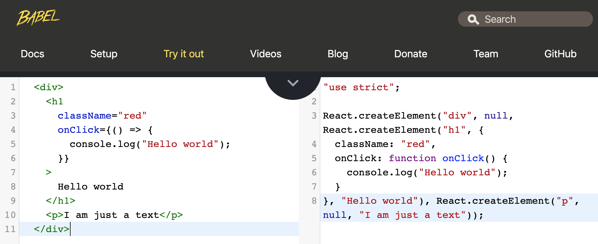

# Creating elements, from DOM to JSX

Task: Use the DOM, `React.createElement()` and JSX methods to create a div, including an h1 and a paragraph.
The h1 should have a class of red and onclick function console logging "Hello World".

### 1. Using DOM

```js
const root = document.getElementById("root");

const divDOM = document.createElement("div");

const h1DOM = document.createElement("h1");
h1DOM.innerText = "Hello World";
h1DOM.classList.add("red");
h1DOM.addEventListener("click", () => console.log("Hello world"));

const pDOM = document.createElement("p");
pDOM.innerText = "I am just a text";

divDOM.appendChild(h1DOM);
divDOM.appendChild(pDOM);
root.appendChild(divDOM);
```

### 2. Using `React.createElement()`

Note: to use react we need to add React cdn scripts (as we're not using a bundler) and a script tag linking to our js file.

```html
<!DOCTYPE html>
<html lang="en">
  <head>
    <meta charset="UTF-8" />
    <meta name="viewport" content="width=device-width, initial-scale=1.0" />
    <meta http-equiv="X-UA-Compatible" content="ie=edge" />
    <title>Intro to React, creating element from DOM to JSX</title>
  </head>
  <body>
    <div id="root"></div>

    <script src="https://unpkg.com/react/umd/react.development.js"></script>
    <script src="https://unpkg.com/react-dom/umd/react-dom.development.js"></script>

    <script src="./index.js"></script>
  </body>
</html>
```

The `React.createElement()` takes three arguments: the element name, its attributes, and children (e.g. text).

```js
const h1React = React.createElement(
  "h1",
  {
    className: "red",
    onClick: () => {
      console.log("Hello world");
    }
  },
  "Hello World"
);

const pReact = React.createElement("p", null, "I am just a text");
const divReact = React.createElement("div", {}, h1React, pReact);

ReactDOM.render(divReact, document.getElementById("root"));
```

### 3. Using JSX

We need to add a babel cdn script and `text/babel` in our script tag so babel can transform our jsx into code the browser will understand. See screenshot after code example.

```html
<script src="https://unpkg.com/babel-standalone"></script>

...

<script src="./index.js" type="text/babel"></script>
```

```js
const jsx = (
  <div>
    <h1
      className="red"
      onClick={() => {
        console.log("Hello world");
      }}
    >
      Hello world
    </h1>
    <p>I am just a text</p>
  </div>
);

ReactDOM.render(jsx, document.getElementById("root"));
```


